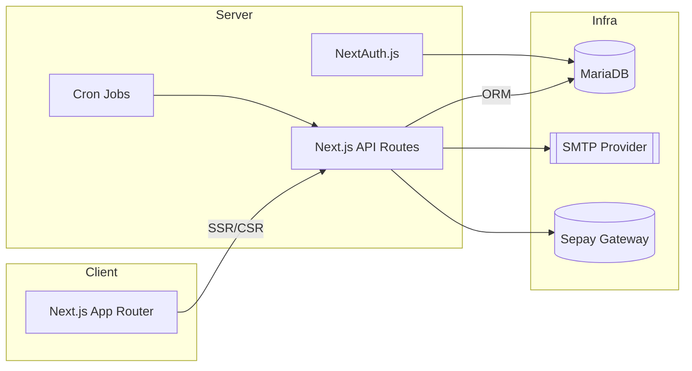

# WSCRM Platform

Giải pháp CRM toàn diện dành cho dịch vụ thiết kế website trọn gói.

---

## 📚 Mục lục
1. [Tổng quan & phạm vi](#tổng-quan--phạm-vi)
2. [Kiến trúc hệ thống](#kiến-trúc-hệ-thống)
3. [Luồng nghiệp vụ chính](#luồng-nghiệp-vụ-chính)
4. [Yêu cầu hệ thống](#yêu-cầu-hệ-thống)
5. [Khởi động nhanh](#khởi-động-nhanh)
6. [Cấu hình môi trường](#cấu-hình-môi-trường)
7. [Cơ sở dữ liệu & Drizzle ORM](#cơ-sở-dữ-liệu--drizzle-orm)
8. [Scripts & công cụ CLI](#scripts--công-cụ-cli)
9. [Cấu trúc thư mục](#cấu-trúc-thư-mục)
10. [Phát triển & quy trình làm việc](#phát-triển--quy-trình-làm-việc)
11. [Front-end UI](#front-end-ui)
12. [PDF & Email](#pdf--email)
13. [Cron jobs & tác vụ nền](#cron-jobs--tác-vụ-nền)
14. [Tích hợp Sepay](#tích-hợp-sepay)
15. [Bảo mật & vận hành](#bảo-mật--vận-hành)
16. [Troubleshooting](#troubleshooting)
17. [FAQ](#faq)
18. [Đóng góp & hỗ trợ](#đóng-góp--hỗ-trợ)
19. [Giấy phép](#giấy-phép)

---

## Tổng quan & phạm vi
- **Đối tượng sử dụng**: Admin, Sales, CSKH, Kế toán.
- **Chức năng chính**:
  - Quản lý khách hàng và lịch sử dịch vụ (domain, hosting, VPS...)
  - Quản lý hợp đồng: tạo, xem, gửi email, xuất PDF.
  - Quản lý hoá đơn: tạo mới, chỉnh sửa, theo dõi thanh toán, gửi PDF qua email.
  - Lịch gửi email nhắc thanh toán định kỳ (weekly, monthly, quarterly, yearly hoặc custom).
  - Dashboard nội bộ, phân quyền qua NextAuth.
  - Tùy biến brand, thông tin công ty, social links, bank info trong Settings.
- **Mục tiêu v1.0.0**:
  - Hoàn thiện chuỗi hợp đồng → hoá đơn → nhắc thanh toán.
  - Hỗ trợ PDF chuyên nghiệp, encode tiếng Việt (Roboto font).
  - UI thống nhất giữa list / detail / edit.

---

## Kiến trúc hệ thống
| Layer       | Công nghệ chính |
|-------------|-----------------|
| Frontend    | Next.js 16 (App Router), React 19, TypeScript, Tailwind 4, shadcn/ui |
| Backend     | Next.js API Routes, NextAuth, Drizzle ORM |
| Database    | MySQL/MariaDB |
| Infra       | SMTP Provider, Cron jobs, Sepay gateway |
| Tooling     | ESLint 9, Turbopack dev server, Sonner toast, date-fns, Zod |



---

## Luồng nghiệp vụ chính
### 1. Hợp đồng
- `/admin/contracts`: danh sách, filter, gửi email hợp đồng.
- `/contract/[id]`: chi tiết public/internal, hỗ trợ tải PDF, gửi mail.
- Sidebar auto highlight “Hợp đồng” cho detail/edit.

### 2. Hoá đơn
- `/admin/invoices`: danh sách, search, status badge, gửi PDF, reminder, delete, edit.
- `/admin/invoices/new`: tạo hoá đơn, line items, preset thuế (KCT/0/8/10/Custom), CustomerCombobox, DatePicker.
- `/admin/invoice/[id]`: xem chi tiết, payment update (full/partial), lịch sử thanh toán, gửi email, reminder, download PDF.
- `/admin/invoice/[id]/edit`: chỉnh sửa, hợp nhất lưu hoá đơn + cấu hình email.
- Hỗ trợ `ccAccountingTeam` dựa trên Settings.

### 3. Settings
- Thông tin công ty: tên, địa chỉ, Mã số thuế, Email kế toán, hotline, bank info.
- Footer social links: Facebook, Twitter/X, TikTok.
- Dữ liệu Settings dùng cho PDF, email, footer.

---

## Yêu cầu hệ thống
- Node.js >= 20 LTS (khuyến nghị Node.js 20.x - phiên bản tối ưu và ổn định nhất).
- npm hoặc pnpm (khuyến nghị pnpm).
- MariaDB/MySQL >= 10.3 (utf8mb4).
- SMTP Provider (Gmail App Password, SendGrid...).
- Tài khoản Sepay nếu dùng QR thanh toán.
- Git, OpenSSL, shell CLI.

---

## Khởi động nhanh
```bash
git clone <repository-url>
cd crm

npm install            # hoặc pnpm install
cp .env.example .env   # cập nhật biến môi trường

npm run db:push        # đồng bộ schema qua Drizzle
# hoặc import thủ công
# mysql -u root -p crm_db < database/schema.sql

npm run dev            # http://localhost:3000
```

---

## Cấu hình môi trường
| Nhóm | Biến | Mô tả |
| --- | --- | --- |
| App | `NEXTAUTH_URL`, `NEXTAUTH_SECRET`, `NEXT_PUBLIC_BRAND_NAME` | URL public, secret auth, brand | 
| Database | `DB_HOST`, `DB_PORT`, `DB_USER`, `DB_PASSWORD`, `DB_NAME`, `DB_SOCKET_PATH?` | Kết nối DB | 
| SMTP | `SMTP_HOST`, `SMTP_PORT`, `SMTP_USER`, `SMTP_PASSWORD`, `SMTP_FROM_NAME` | Gửi email | 
| Cron | `EMAIL_CRON_SECRET` | Token bảo vệ endpoint cron | 
| Sepay | `SEPAY_API_KEY`, `SEPAY_PAYMENT_CODE_PREFIX` | Tuỳ chọn nếu dùng QR | 

> Production: sử dụng secret manager hoặc biến môi trường riêng (`.env.production`).
> Shared hosting: dùng `DB_SOCKET_PATH` (VD `/var/lib/mysql/mysql.sock`).

---

## Cơ sở dữ liệu & Drizzle ORM
- Schema định nghĩa tại `src/lib/schema/index.ts`.
  - Các bảng chính: `users`, `customers`, `contracts`, `contract_items`, `invoices`, `invoice_items`, `invoice_schedules`, `invoice_payments`, `settings`, ...
  - `invoice_schedules` chứa: `frequency`, `intervalDays`, `sendTime`, `startDate`, `daysBeforeDue`, `ccAccountingTeam`, `lastSentAt`.
- File SQL tham khảo: `database/schema.sql` (tạo bảng, sample data).
- Luồng cập nhật schema:
  1. Cập nhật TypeScript schema.
  2. `npm run db:generate` (tạo migration SQL).
  3. `npm run db:push` (DEV) hoặc chạy SQL migration (PROD).

### Lệnh DB hữu ích
```bash
npm run db:generate   # Tạo migration từ schema TS
npm run db:push       # Đồng bộ schema DEV
npm run db:studio     # Giao diện web quản lý DB (Drizzle Studio)
```

---

## Scripts & công cụ CLI
```bash
npm run dev          # Turbopack + HMR
npm run build        # Build production
npm run start        # Chạy server production
npm run lint         # ESLint (ts/tsx)
npm run db:generate  # Sinh migration
npm run db:push      # Đồng bộ schema
npm run db:studio    # Drizzle Studio
```

---

## Cấu trúc thư mục
```
src/
├─ app/
│  ├─ admin/                # Mô-đun quản trị (dashboard, customers, contracts, invoices,...)
│  ├─ contract/[id]/        # Trang chi tiết hợp đồng (CSR + fetch API)
│  ├─ api/                  # API Routes cho auth, invoices, contracts, settings…
│  └─ auth/                 # Đăng nhập/Đăng ký/Quên mật khẩu
├─ components/
│  ├─ layout/               # Header, sidebar, footer (member & admin)
│  └─ ui/                   # Thành phần shadcn/ui mở rộng
├─ lib/
│  ├─ database.ts           # Drizzle adapter + pooling
│  ├─ schema/               # Định nghĩa bảng
│  ├─ invoices/
│  │  ├─ pdf-builder.ts     # Sinh PDF hoá đơn (pdf-lib)
│  │  ├─ utils.ts           # Tính tổng, logic liên quan hoá đơn
│  │  └─ mailer.ts          # Hàm gửi email hoá đơn/reminder
│  ├─ contracts/pdf-generator.ts
│  ├─ email.ts              # Tầng gửi email SMTP (hỗ trợ attachments, CC)
│  └─ utils.ts              # format date/currency, helper chung
├─ public/
│  └─ fonts/Roboto-*.ttf    # Font hỗ trợ tiếng Việt cho pdf-lib
└─ database/
   ├─ schema.sql
   └─ migrations/
```

---

## Phát triển & quy trình làm việc
1. Tạo nhánh: `git checkout -b feature/<ten-tinh-nang>`.
2. Cập nhật schema nếu cần → `npm run db:generate` → commit migration.
3. Code + chạy lint (`npm run lint`).
4. Viết test (nếu có) / manual QA.
5. Commit theo Conventional Commits (VD: `feat: add invoice scheduler`).
6. Tạo PR, mô tả bước kiểm thử + ảnh chụp.

### Lưu ý khi làm việc
- Next.js 16 (App Router) → dynamic route params là Promise, luôn `await params` trong API Route.
- Sử dụng `use client` khi truy cập browser API hoặc state hooks.
- Tách logic tính toán tổng hoá đơn vào `lib/invoices/utils.ts`.
- Toast UI dùng Sonner: `toast.success`, `toast.error` trong client components.

---

## Front-end UI
- Tailwind CSS 4: sử dụng class utilities, gradient, shadow.
- shadcn/ui: Button, Card, Table, Dialog, Input, Select, Switch, Badge, DatePicker.
- Custom components: `CustomerCombobox`, `DatePicker` (dayjs/date-fns), `TikTokIcon`.
- Responsive: grid cards (admin dashboard), flex layout, `px-6` padding.
- Sidebar highlight: logic trong `src/components/layout/sidebar.ts` kiểm tra pathname (`/admin/invoice/[id]` → active menu “Hoá đơn”).

---

## PDF & Email
### PDF hoá đơn (`lib/invoices/pdf-builder.ts`)
- Sử dụng `pdf-lib` + `@pdf-lib/fontkit` + font Roboto để encode tiếng Việt.
- Layout chuẩn hoá:
  1. Logo & brand bên trái – tiêu đề & trạng thái thanh toán bên phải (màu sắc).
  2. Thông tin công ty (từ Settings) bên trái – khách hàng bên phải (căn phải).
  3. Bảng chi tiết sản phẩm (header nền xám, border collapse).
  4. Tổng kết thanh toán (bao gồm `paid` nếu partial, `balance`).
  5. Hình thức thanh toán (không hiển thị bank detail cố định – dùng Settings).
- Website lấy từ biến `NEXTAUTH_URL`.

### Email hoá đơn & reminder
- Logic tập trung tại `lib/invoices/mailer.ts` (tái sử dụng cho API và cron).
- Template HTML: table chi tiết, tổng kết, ghi chú (nếu có), attach PDF.
- CC ké toán khi `ccAccountingTeam` bật và Settings có `companyAccountingEmail`.
- API liên quan:
  - `POST /api/invoice/[id]/send`: gửi email hoá đơn ngay lập tức.
  - `POST /api/invoice/[id]/reminder`: gửi email nhắc thanh toán.
  - `POST /api/invoice/[id]/pdf`: tải PDF.

---

## Cron jobs & tác vụ nền
### Email nhắc hợp đồng/dịch vụ (tồn tại từ trước)
```bash
0 8 * * * curl -X POST "https://yourdomain.com/api/email-notifications/cron?token=YOUR_EMAIL_CRON_SECRET"
*/5 * * * * curl -X POST "https://yourdomain.com/api/email-notifications/cron-process?token=YOUR_EMAIL_CRON_SECRET"
```

### Hoá đơn: lịch nhắc thanh toán
- Endpoint: `POST /api/invoices/cron?token=EMAIL_CRON_SECRET`
- Tác vụ:
  - Đọc bảng `invoice_schedules` (enabled).
  - Kiểm tra `sendTime` (±10 phút), `frequency`, `intervalDays`, `startDate`, `daysBeforeDue`.
  - Bỏ qua invoice **PAID** hoặc `balance <= 0`.
  - Gửi email reminder (reuse `sendInvoiceReminderEmail`).
  - Ghi lại `lastSentAt` để tránh gửi trùng ngày.
- Gợi ý cron: chạy mỗi 10 phút để không bỏ lỡ cửa sổ gửi.
- Test cục bộ:
```bash
curl -X POST "http://localhost:3000/api/invoices/cron?token=YOUR_EMAIL_CRON_SECRET"
```

> **Lưu ý Prod**: bảo vệ endpoint bằng token bí mật (`EMAIL_CRON_SECRET`), chỉ gọi từ cron server/bastion. Có thể deploy dưới worker, serverless function hoặc job scheduler (GitHub Actions, Railway, Render...).

### Cron cho Sepay
- Khi triển khai thanh toán tự động, có thể thêm job để đồng bộ webhook (tuỳ nhu cầu).

---

## Tích hợp Sepay
1. Đăng ký tài khoản Sepay, lấy API Key.
2. Cấu hình `.env` với `SEPAY_API_KEY`, `SEPAY_PAYMENT_CODE_PREFIX`.
3. Webhook: `https://yourdomain.com/api/webhooks/sepay`.
4. Luồng: tạo đơn → sinh QR → khách chuyển khoản → Sepay callback → cập nhật `payments`.

---

## Bảo mật & vận hành
- Hash mật khẩu bằng `bcrypt` (cost 10).
- Không commit `.env` / secrets.
- Bật HTTPS khi deploy (NextAuth bắt buộc).
- Hạn chế IP truy cập DB (firewall/security group).
- Sao lưu DB định kỳ (cron hoặc managed backup).
- Giữ font Roboto trong `public/fonts` để PDF encode chuẩn.
- Sử dụng `EMAIL_CRON_SECRET` mạnh (>= 32 ký tự random).

### Deploy gợi ý
- **VPS tự quản lý**: Xem hướng dẫn chi tiết tại [DEPLOYMENT.md](./DEPLOYMENT.md) - bao gồm cài đặt VPS, Nginx, SSL, PM2, Cron jobs.
- **Vercel / Next.js App Router**: Chạy tốt serverless, cần DB pooling (PlanetScale, Neon...).
- **Node server tự host**: Build `npm run build`, start `npm run start`.
- **Cron**: Dùng dịch vụ như `cron-job.org`, GitHub Actions, Cloudflare Workers Cron, hoặc server cá nhân chạy `crontab`.

---

## Troubleshooting
- **Không kết nối được DB**: kiểm tra host/port, user/password, hoặc dùng socket.
- **Trùng index khi import schema**: thông báo `Duplicate key` khi lặp import, có thể bỏ qua.
- **Không nhận email**: kiểm tra SMTP credentials, TLS, port, firewall.
- **Không nhận CC**: đảm bảo `companyAccountingEmail` trong Settings và bật CC.
- **PDF lỗi font**: chắc chắn đã copy `Roboto-Regular.ttf` & `Roboto-Bold.ttf` vào `public/fonts`.
- **Lỗi `params` trong API**: phải `const resolved = await params` vì Next.js 16 trả Promise.
- **Cron không gửi reminder**: kiểm tra token, `sendTime`, trạng thái invoice, `lastSentAt`.

---

## FAQ
- **Có hỗ trợ MySQL?** Có, miễn cấu hình `utf8mb4`.
- **Có seed dữ liệu mẫu?** Chỉ tạo admin; bạn có thể thêm seed riêng.
- **Hỗ trợ đa ngôn ngữ?** UI hiện tiếng Việt; có thể tích hợp `next-intl`.
- **Chạy trên serverless được không?** Được (Vercel). Lưu ý connection pooling DB.
- **Auto invoice scheduling có cần cron?** Có – endpoint `/api/invoices/cron` cần được gọi theo lịch (5–10 phút/lần).
- **Có test tự động?** Đang triển khai Playwright/E2E; đóng góp test case được khuyến khích.

---

## Đóng góp & hỗ trợ
1. Fork repo & tạo branch `feature/<ten>`.
2. Viết code, cập nhật README nếu thêm tính năng lớn.
3. Chạy lint/test trước khi commit.
4. Gửi PR kèm mô tả, screenshot, bước kiểm thử.

> Liên hệ khẩn cấp: tạo issue với log + step tái hiện + môi trường.

---

## Giấy phép
- License: **GPL**
- Hỗ trợ: xem [Troubleshooting](#troubleshooting) và liên hệ qua issue tracker.

---

**Made with ❤️ to streamline digital service operations. Chào mừng bạn đến với WSCRM Platform!**
